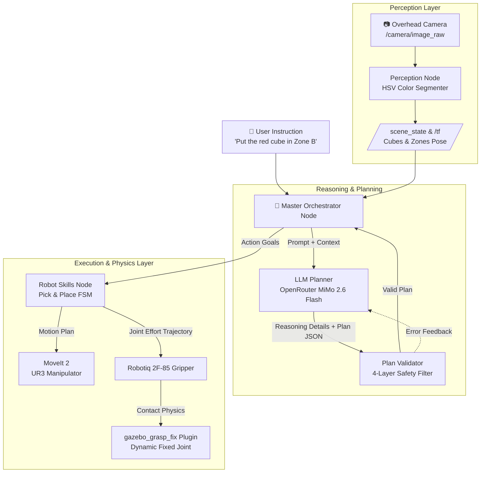

<div align="center">

# 🤖 Autonomous Semantic TAMP with LLM for UR3 Manipulator
### Task & Motion Planning for Universal Robots UR3 + Robotiq 2F-85 in ROS 2 Humble & Gazebo

[](https://docs.ros.org/en/humble/)
[](http://gazebosim.org/)
[](https://moveit.picknik.ai/humble/)
[](https://openrouter.ai/)
[](LICENSE)

*Hệ thống điều khiển tay máy UR3 thông minh tích hợp Mô hình Ngôn ngữ Lớn (LLM), Lập kế hoạch Tác vụ và Quỹ đạo Chuyển động (TAMP), Cơ chế tiền thu hồi không gian (Spatial Preemption / Multi-step Reasoning) và Mô phỏng vật lý tiếp xúc chân thực với Plugin `gazebo_grasp_fix`.*

---

[Kiến Trúc Hệ Thống](#-kiến-trúc-hệ-thống) •
[Điểm Nổi Bật](#-tính-năng-nổi-bật) •
[Cài Đặt & Yêu Cầu](#-cài-đặt--yêu-cầu) •
[Hướng Dẫn Chạy](#-hướng-dẫn-chạy-thực-nghiệm) •
[Cấu Trúc Thư Mục](#-cấu-trúc-kho-mã-nguồn) •
[Tác Giả](#-tác-giả)

</div>

---

## 🌟 Tính Năng Nổi Bật

1. **🧠 Tích hợp LLM Reasoning Đa Tầng (ReAct Framework):**
   - Hỗ trợ mô hình ngôn ngữ **`xiaomi/mimo-v2.6-flash`** qua OpenRouter API với chế độ chuỗi tư duy suy luận (`reasoning: {"enabled": True}`) và bảo toàn nguyên vẹn `reasoning_details` qua các lượt hội thoại.
   - Hỗ trợ **Fallback Offline Mode**: Tự động chuyển sang bộ giải suy diễn dựa trên luật (Rule-based Planner) khi gõ `offline` hoặc không có API key.

2. **⚡ Xử lý Xung Đột Không Gian Nâng Cao (Spatial Preemption & Temp Relocation):**
   - Giải quyết bài toán di dời vật thể cản trở: Khi vùng đích bị chiếm dụng (ví dụ: yêu cầu đặt `red_cube` vào `Zone B` nhưng `Zone B` đang có `blue_cube`), hệ thống tự động sinh kế hoạch nhiều bước:
     $$\text{Detect} \to \text{Check Collision} \to \text{Relocate Obstacle} \to \text{Pick Target} \to \text{Place Target} \to \text{Home}$$
   - Thuật toán **Dynamic Free Position Search**: Quét lưới ma trận không gian làm việc của robot theo thời gian thực từ camera `/scene_state`, đảm bảo khoảng cách an toàn với vật cản ($\ge 7.5\text{ cm}$) và các vùng đặt đích ($\ge 8.5\text{ cm}$).

3. **🛡️ Bộ Kiểm Duyệt Kế Hoạch 4 Lớp (Plan Validator):**
   - **Syntax Validator**: Kiểm tra định dạng JSON và từ vựng kỹ năng hành động.
   - **Semantic Affordance**: Đảm bảo điều kiện tiên quyết (ví dụ: không thể `pick` khi đang giữ vật thể, không thể `place` khi tay gắp trống).
   - **Spatial Reachability**: Kiểm tra giới hạn không gian làm việc ($R \le 0.45\text{ m}, z \ge 0.85\text{ m}$).
   - **Physical Feasibility**: Ngăn ngừa xung đột chiếm dụng kép tại các vùng đích.

4. **🦾 Vật Lý Kẹp Tiếp Xúc Chân Thực (`gazebo_grasp_fix`):**
   - Loại bỏ hoàn toàn phương pháp hút chân không (vacuum suction) phi thực tế.
   - Sử dụng plugin C++ `gazebo_grasp_fix` liên kết động (`FixedJoint`) với `wrist_3_link` khi hai má kẹp Robotiq 2F-85 tiếp xúc đồng thời với vật thể, và tự động hủy liên kết khi góc mở khớp vượt ngưỡng an toàn ($> 0.15\text{ rad}$).

---

## 🏗️ Kiến Trúc Hệ Thống



---

## 📋 Yêu Cầu Môi Trường

- **Hệ điều hành:** Ubuntu 22.04 LTS (Hỗ trợ tốt trên WSL2)
- **ROS 2:** Humble Hawksbill (Desktop-Full)
- **Gazebo:** Classic 11
- **MoveIt 2:** `ros-humble-moveit`
- **Python:** 3.10+ với các thư viện:
  ```bash
  pip install requests pyyaml numpy
  ```

---

## 🚀 Cài Đặt

1. **Clone repository về workspace của bạn:**
   ```bash
   mkdir -p ~/ur3_llm_ws/src
   cd ~/ur3_llm_ws/src
   git clone https://github.com/Tuan404cl/ur3_llm_ws.git .
   ```

2. **Cài đặt các dependencies cần thiết:**
   ```bash
   sudo apt update
   sudo apt install -y \
       ros-humble-moveit \
       ros-humble-gazebo-ros-pkgs \
       ros-humble-joint-state-publisher-gui \
       ros-humble-controller-manager \
       ros-humble-ros2-control \
       ros-humble-ros2-controllers
   ```

3. **Biên dịch Workspace:**
   ```bash
   cd ~/ur3_llm_ws
   source /opt/ros/humble/setup.bash
   colcon build --symlink-install
   source install/setup.bash
   ```

---

## 🎮 Hướng Dẫn Chạy Thực Nghiệm

Mỗi bước chạy trên một Terminal riêng biệt (đừng quên `source install/setup.bash` ở mỗi terminal):

### 1. Khởi động môi trường Gazebo & Robot UR3
```bash
ros2 launch ur3_llm_tamp tamp_sim.launch.py
```

### 2. Khởi động MoveIt 2 & Hệ Thống Kỹ Năng (Robot Skills)
```bash
# Terminal 2: MoveIt Planning & Execution
ros2 launch ur3_gripper_moveit_config demo.launch.py

# Terminal 3: Node Kỹ năng gắp đặt (Skills Server)
ros2 run ur3_llm_tamp robot_skills
```

### 3. Khởi động Node Thị Giác (Perception)
```bash
ros2 run ur3_llm_tamp perception_node
```

### 4. Khởi động Bộ Điều Phối Chính (Master Orchestrator)
```bash
ros2 run ur3_llm_tamp master_orchestrator
```
> **Lưu ý:** Terminal sẽ hỏi bạn nhập `OPENROUTER_API_KEY`:
> - Dán API Key OpenRouter của bạn để sử dụng mô hình trực tuyến `xiaomi/mimo-v2.6-flash`.
> - Hoặc gõ **`offline`** (hoặc nhấn **Enter**) để chạy bộ lập lịch luật ngoại tuyến (Offline Rule-based Planner).

### 5. Gửi Câu Lệnh Điều Khiển (Commander Node)
```bash
ros2 run ur3_llm_tamp commander
```

#### Một số câu lệnh mẫu thử nghiệm:
| Câu lệnh | Hành động của Hệ thống |
| :--- | :--- |
| `Put the red cube in Zone A` | Gắp khối đỏ đặt vào Vùng A (Mức cơ bản) |
| `Put the green cube in Zone C` | Gắp khối xanh lá đặt vào Vùng C |
| `Put the red cube in Zone B` *(Khi Zone B đang có blue cube)* | **Kịch bản Nâng cao:** Tự động di dời `blue_cube` ra vị trí tạm an toàn $\to$ gắp `red_cube` vào `Zone B` |
| `scene` | Hiển thị vị trí thời gian thực của toàn bộ vật thể và các vùng |
| `exit` | Thoát chương trình |

---

## 📂 Cấu Trúc Kho Mã Nguồn

```plaintext
src/
├── ur3_llm_tamp/                     # Package điều khiển ngữ nghĩa cốt lõi
│   ├── ur3_llm_tamp/
│   │   ├── master_orchestrator_node.py # Bộ điều phối chính vòng kín ReAct
│   │   ├── llm_planner.py              # Bộ lập kế hoạch OpenRouter / MiMo 2.6 Flash
│   │   ├── plan_validator.py           # Bộ kiểm duyệt an toàn 4 lớp
│   │   ├── robot_skills.py             # Máy trạng thái thực thi Pick/Place với MoveIt
│   │   ├── perception_node.py          # Xử lý ảnh overhead camera nhận diện vật thể
│   │   ├── commander_node.py           # Giao diện dòng lệnh tương tác người dùng
│   │   └── world_model.py              # Mô hình không gian & tìm vị trí trống động
│   ├── launch/                         # Launch files tích hợp Gazebo & Robot
│   ├── models/                         # Các mô hình SDF vật thể (khối màu, zone)
│   ├── scenarios/                      # Cấu hình các kịch bản thử nghiệm
│   └── urdf/                           # File mô tả robot UR3 gắn Robotiq 2F-85
├── gazebo_grasp_plugin/              # Plugin C++ gazebo_grasp_fix cho kẹp 2 ngón
├── ur3_gripper_moveit_config/        # Cấu hình MoveIt 2 cho UR3 + Robotiq 2F-85
└── Universal_Robots_ROS2_Description/ # URDF & Meshes chuẩn cho dòng UR
```

---

## 👨‍💻 Tác Giả & Lời Cảm Ơn

- **Sinh viên thực hiện:** Nguyễn Quang Tuân (MSSV: 23020735)
- **Khoa / Trường:** Khoa Điện tử Viễn thông, Trường Đại học Công nghệ – Đại học Quốc gia Hà Nội (VNU-UET).
- **Giảng viên hướng dẫn:** PGS. TS. Hoàng Văn Xiêm, CN. Nguyễn Quốc Bảo.

---
<div align="center">
  <sub>Được phát triển với niềm đam mê Robotics & AI tại VNU-UET 🇻🇳</sub>
</div>
